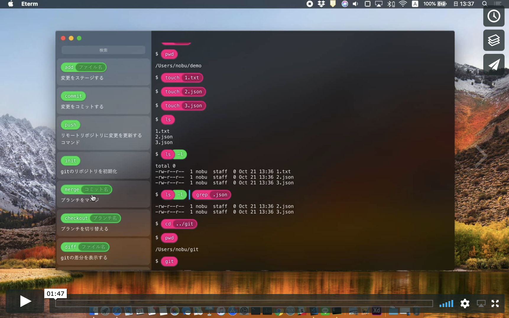

# Eterm - Best Terminal for Education

## 製品概要

### 黒い画面 x Tech

### 背景（製品開発のきっかけ、課題等）
黒い画面（=CUI）は非常に便利なもので、ITエンジニアには必須です。   
しかし、CUIの操作は初めての人にはハードルが高く、学習は容易ではありません。  
そこで、プログラミング環境の[Scratch](https://scratch.mit.edu)のようなインターフェースを持つターミナルがあればよいのではないかと考え、製作に至った。

### 製品説明（具体的な製品の説明）

### 特長

#### 1. 独自のインターフェース
初心者にも分かりやすいグラフィカルなインターフェースを設計・実装しました。  
Scratchのようなブロックをドラッグアンドドロップすることによるコマンドの入力が行えます。

#### 2. 機械学習によるコマンド推薦
機械学習（Ngram）を用いたコマンド推薦アルゴリズムを開発しました。

### 解決出来ること
CUIのハードルを下げ、学習を容易にする

### 今後の展望
今回機械学習に使用したデータセットは、開発期間中に用意した単純なものであるため、より大きなデータセット（コマンド履歴）を用いたコマンド推薦を行いたい。  
また、UXの微調整を行いたい。

## 開発内容・開発技術
### 活用した技術
#### API・データ
特になし

#### フレームワーク・ライブラリ・モジュール

* [Vue](https://github.com/vuejs/vue)
* [Electron](https://github.com/electron/electron)

#### デバイス
特になし

### 研究内容・事前開発プロダクト（任意）
特になし

### 独自開発技術（Hack Dayで開発したもの）

* Ngramを用いたコマンド推薦のモデル
* 独自のインターフェースを持ったデスクトップアプリケーション

