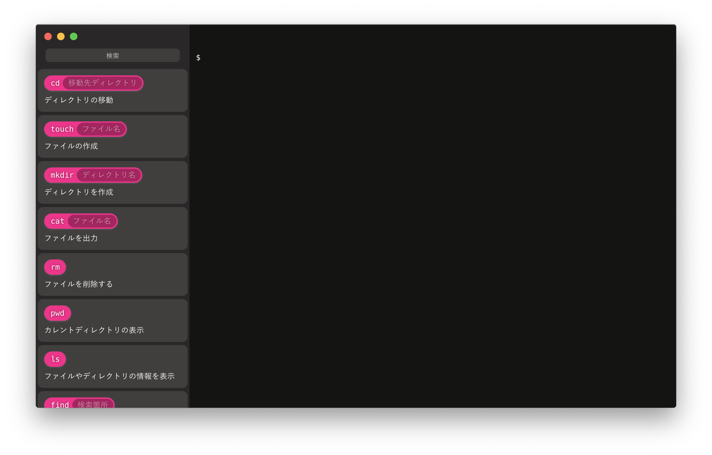

# Eterm

## 製品概要
### 黒い画面 Tech

### 背景（製品開発のきっかけ、課題等）
黒い画面(CUI)を用いた操作は非常に便利であり、ITエンジニアには必須スキルである。  
しかし、CUIを用いた操作はハードルが高く、学習は容易ではない。
そこで、プログラミング言語のスクラッチのようなインターフェースを持った黒い画面があれば、学習を容易にできるのではないかと思い、製作に至った。

### 製品説明（具体的な製品の説明）

### 特長

#### 1. 特長1
ドラッグ&ドロップで組み立て可能なコマンドのインターフェース

#### 2. 特長2
機械学習を用いた入力中のコマンドから次コマンドの推薦

#### 3. 特長3
かっこいい画面

### 解決出来ること
CUIでの操作の学習を容易にする。

### 今後の展望
今回使用したデータセットは、ハッカソンの期間中に作り上げた簡単なデータセットを使用している。そのため、推薦される次のコマンドが限定的になってしまっている。  
そのため、より網羅的なコマンドが用いられているデータセットを用いたコマンド推薦を行いたい。

GUIの方は自分わかんねっす

## 開発内容・開発技術
### 活用した技術
#### API・データ
特になし

#### フレームワーク・ライブラリ・モジュール
* Vue
* Electron

#### デバイス
特になし

### 研究内容・事前開発プロダクト（任意）
特になし

### 独自開発技術（Hack Dayで開発したもの）
#### 2日間に開発した独自の機能・技術
* コマンドのデータセットとNgramを用いたコマンド推薦のモデル
* ドラッグ&ドロップで操作可能なわかりやすいインターフェース
