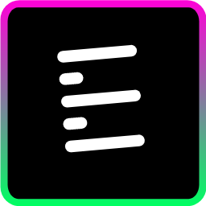
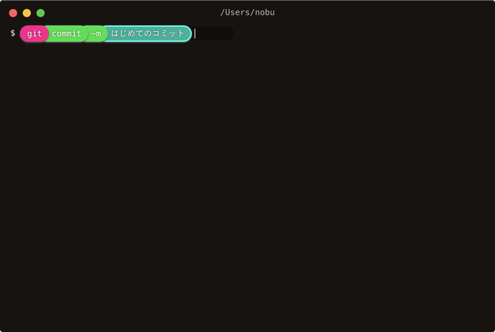

#  Eterm

公式サイト: https://eterm.tokyo

[Hack Day時点の動画を再生](https://vimeo.com/296239145)

## 製品概要

### 黒い画面 x Tech

### 背景（製品開発のきっかけ、課題等）
黒い画面（CUI）は非常に便利かつ、ITエンジニアには必須なものです。   
しかし、その操作は初めての人には分かりにくく、学習は容易ではありません。  
そこで、プログラミングにおける[Scratch](https://scratch.mit.edu)のようなターミナルがあればよいのではないかと考えました。

### 製品説明（具体的な製品の説明）

### 特長

#### 1. 独自のインターフェース
どこに何を入力すればよいのかが一目で分かる、グラフィカルなインターフェースを採用しています。  
コマンドやオプションの選択を、キーボードだけでなくマウスでも行えます。  

#### 2. コマンドの推薦アルゴリズム
木構造のデータを用いた推薦機能を搭載しています。
専用のデータは、[モデルフォーマット](model)に従い作成できます。

### 解決出来ること
CUIのハードルを下げ、簡単に学べるようにします。

### 今後の展望
リリースを目指し改善を進めます。

## 開発内容・開発技術
### 活用した技術
#### API・データ
ありません。

#### フレームワーク・ライブラリ・モジュール
* [Electron](https://github.com/electron/electron)
* [Vue](https://github.com/vuejs/vue)

#### デバイス
ありません。

### 研究内容・事前開発プロダクト（任意）
ありません。

### 独自開発技術（Hack Dayで開発したもの）
* コマンド推薦アルゴリズムおよびモデル
* 独自のインターフェースを持ったデスクトップアプリケーション

